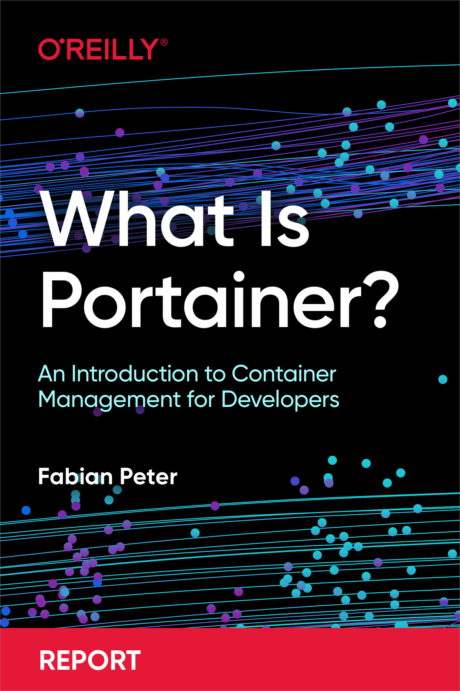

Book Report Name: [What is Portainer](https://learning.oreilly.com/library/view/-/9781098142100/){:target="_blank"}?

Author Name: Fabian Peter

Published by: O'reilly Media, Inc.

Pages: 40

Rating: 5/5

This small book report on Portainer is an awesome read. The author has done a nice job of explaining the different use cases of Portainer which helps you manage containers in a variety of settings and gets you started without getting too deep into the knowledge of containers. I definitely recommend everyone read this short report for developers, architects, devOps engineers and managers to see the benefits and use it in their projects.