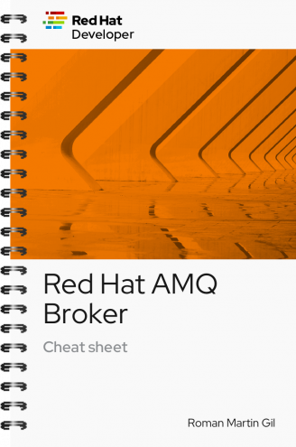

Cheetsheet Book Name: [Red Hat AMQ Broker Cheetsheet](https://developers.redhat.com/cheat-sheets/red-hat-amq-broker-cheat-sheet){:target="_blank"}

Author Name: Roman Martin Gil

Published by: Red Hat

Pages: 13

Rating: 4/5

This short cheetsheet ebook is a nice to have and get quickly started on Red Hat AMQ. It contains most commonly used commands and setup architectures which would be very handy to keep for use. I think a single page dedicated to Red Hat AMQ would have been very nice for people getting started and understand AMQ.