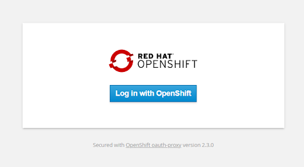

Red Hat has been generous enough to give a trial period of 2 months to try out its Openshift Data Science Service. A quick sneak peek intro to it can be reviewed [here](https://www.redhat.com/en/technologies/cloud-computing/openshift/openshift-data-science){:target="blank"} which also gives a link to try it out.

Clicking on Try it button leads to the login page. After successful authentication, it takes you to below page where it asks to “Try Openshift Data Science in the sandbox”.

Once clicked, it will ask for your number details to send an OTP to confirm your identity and prevent misuse of the service.

This will give you a link to start using Openshift Data Science.

Clicking on Start button leads you to authenticate using Openshift Sandbox.

Authorise access:

This will then ask to choose among three options. Choose the managed service where Red Hat takes care to host the openshift data science service and gives you trial access for 2 months. At this stage, you should be all good to get started using various services in Red Hat Data Science Service.