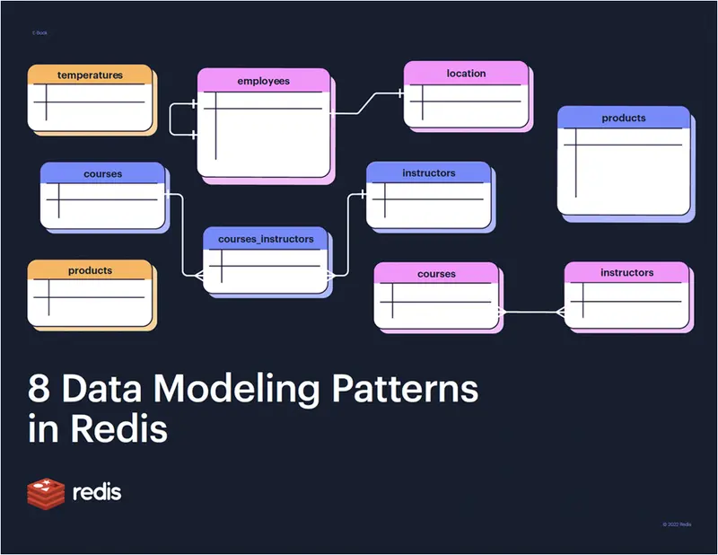

EBook Name: [Learn 8 Data Modelling Patterns in Redis](https://redis.com/docs/8-data-modeling-patterns-in-redis/){:target="_blank"}?

Author Name: N/A

Published by: Redis

Cost: Free

Pages: 56

Rating: 5/5

This handy small ebook is an interesting read about Redis and the different data modelling patterns one can use in Redis. The patterns are a handy addon to your knowledge and will definitely help you in your practical approaches dealing with a variety of problem statements. Each pattern is well explained with concepts and examples to give a clear understanding related to them.