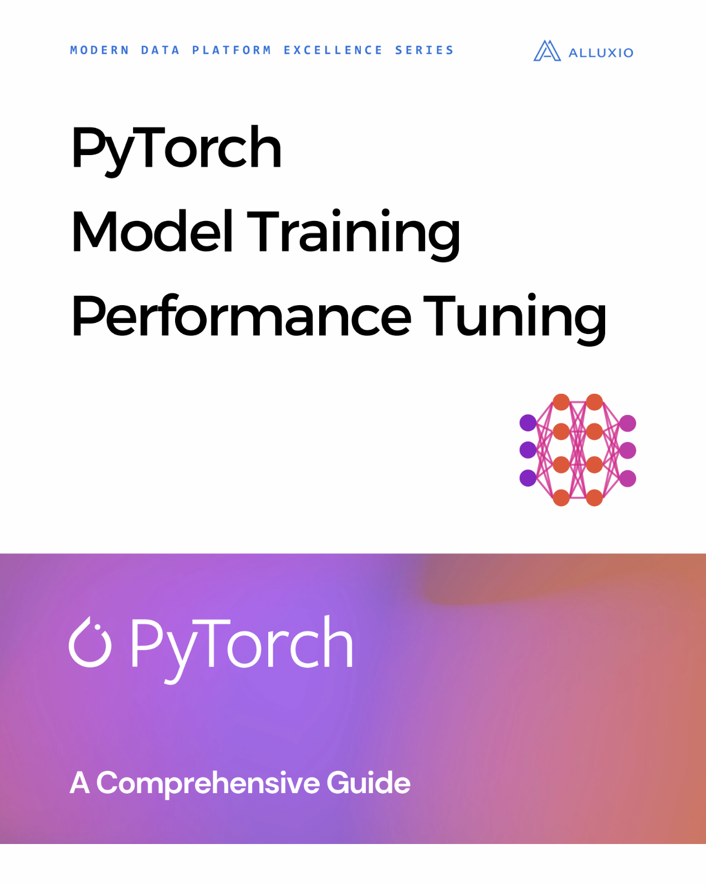

Book Report Name: [Pytorch model training performance tuning](https://www.alluxio.io/resources/modern-data-platform-excellence-series/pytorch-model-training-performance-tuning-a-comprehensive-guide/){:target="_blank"}

Published by: Alluxio

Pages: 44

Rating: 5/5

 
 
Discover the ultimate secret to unlocking the full potential of your PyTorch model training in Alluxio's latest short book! Packed with practical tips and real-world case studies, this guide is a game-changer for both beginners and seasoned practitioners. Learn the basics of PyTorch and understand the factors that influence model training performance in the ML pipeline.

From data loading to GPU and CPU processing, Alluxio leaves no stone unturned, providing lines of code to optimize every step. With average training epoch times reduced by 5-10x, you can achieve blazingly fast training pipelines. Don't miss this opportunity to revolutionize your PyTorch training—grab a copy of the book and supercharge your AI endeavors today!