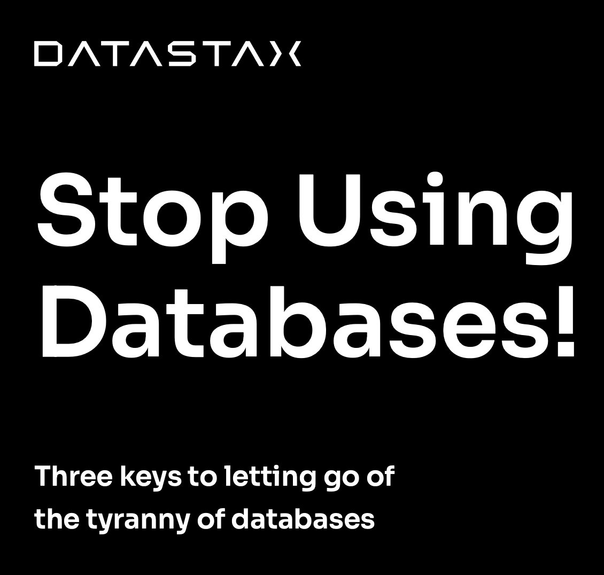

Book Report Name: [Stop using databases](https://pages.datastax.com/cnp-stop-using-databases.html){:target="_blank"}

Published by: Datastax

Pages: 11

Rating: 4/5

 
 
"Stop Using Databases" is a must-read ebook for developers seeking to accelerate app production and overcome the limitations of traditional databases. The book offers an intriguing alternative, emphasizing the benefits of renting over owning and advocating a service-based mindset. With a focus on defining and refining, it empowers readers to achieve newfound agility, seamless cloud migration, and the liberation of serverless freedom. In just a few pages, the ebook delivers valuable insights that can revolutionize app development practices and drive innovation in the cloud-native landscape.