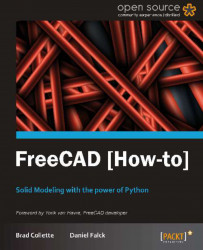
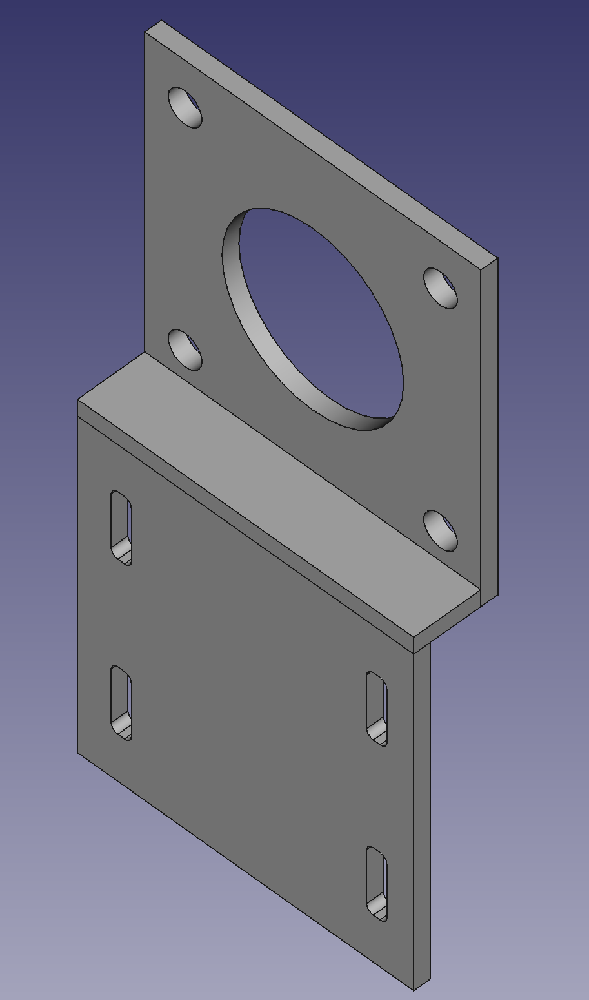

Book Name: [FreeCAD How to](https://www.packtpub.com/product/freecad/9781849518864){:target="_blank"}

Published by: Packt, 2012

Author: Brad Collette, Daniel Falck

Pages: 70

Rating: 5/5

 
 
FreeCAD is a free and open-source 3D parametric modeling software used for computer-aided design (CAD). It provides a platform for creating, modifying, and analyzing 3D models, especially those used in mechanical engineering, product design, architecture, and other related fields.

In the world of computer-aided design, FreeCAD shines as a free and open-source gem. Recently, I stumbled upon the book "FreeCAD How To" by Packt, a concise yet captivating read that introduced me to the wonders of FreeCAD. Despite its 2012 publication, the book's clear instructions and code remain remarkably relevant even in 2023.

FreeCAD's intuitive interface and parametric modeling approach immediately caught my attention. With its diverse workbenches catering to different tasks, I swiftly delved into creating 3D models with ease. The book's reader-friendly style made the learning process enjoyable and engaging.

Intrigued by its capabilities, I embarked on a journey to design my first 3D part using FreeCAD. The software's flexibility allowed me to explore various geometric elements, tweak parameters, and iterate my design effortlessly.

The book's insights into Python scripting further empowered me, adding an element of creativity to my designs. This small yet impactful book sparked a passion for 3D modeling and opened a world of opportunities. For anyone eager to embrace the world of FreeCAD, "FreeCAD How To" is an indispensable read. Whether you're a professional or a hobbyist, this book will inspire you to unleash your creativity and bring your ideas to life.

A sample part I was able to design using the book.

In conclusion, my journey with FreeCAD has been nothing short of thrilling. Its enduring relevance and the book's delightful guidance have made this experience truly memorable. I now eagerly look forward to exploring more possibilities and pushing the boundaries of my imagination with FreeCAD as my trusted companion. Happy designing!