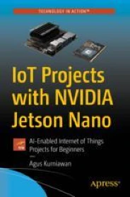

Book Report Name: [IOT Projects with nvidia jetson nano](https://link.springer.com/book/10.1007/978-1-4842-6452-2){:target="_blank"}

Published by: Apress, 2021

Author: Agus Kurniawan

Pages: 123

Rating: 4/5

 
 
In my recent quest to dive into the world of NVIDIA GPU CUDA and rapid prototyping, I stumbled upon the perfect tool - the Jetson Nano IoT device. Eager to get started, I found a fantastic book that catered to beginners, offering a seamless introduction to Linux basics, installation, peripheral understanding, and project building - "IOT Projects with nvidia jetson nano" by Apress.

The book's user-friendly approach made it an absolute gem for anyone intrigued by GPUs, machine learning, and quick prototyping. With the Jetson Nano as my companion, I quickly unleashed the immense potential of CUDA technology and explored a plethora of capabilities that this unique device had to offer.

Thanks to this invaluable resource, I was able to embark on exciting projects, pushing the boundaries of innovation and witnessing the true power of NVIDIA GPU CUDA. For anyone looking to delve into this fascinating world, I wholeheartedly recommend this book as the perfect guide to kickstart your journey into the realm of GPUs and machine learning. Happy prototyping!