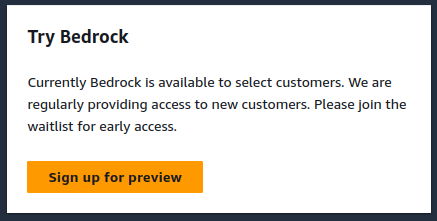

[Amazon Bedrock](https://aws.amazon.com/bedrock/){:target="_blank"} is a fully managed service that makes foundation models (FMs) from Amazon and leading AI startups available through an API so you can choose from various FMs to find the model that's best suited for your use case.

At this point in time, it is supported in three regions:
1. US West (Oregon)
2. US East (N. Virginia)
3. US East (Ohio)

On visiting the Amazon console page for this service, I get a warning that this is currently in preview and is available only for select customers as below.

