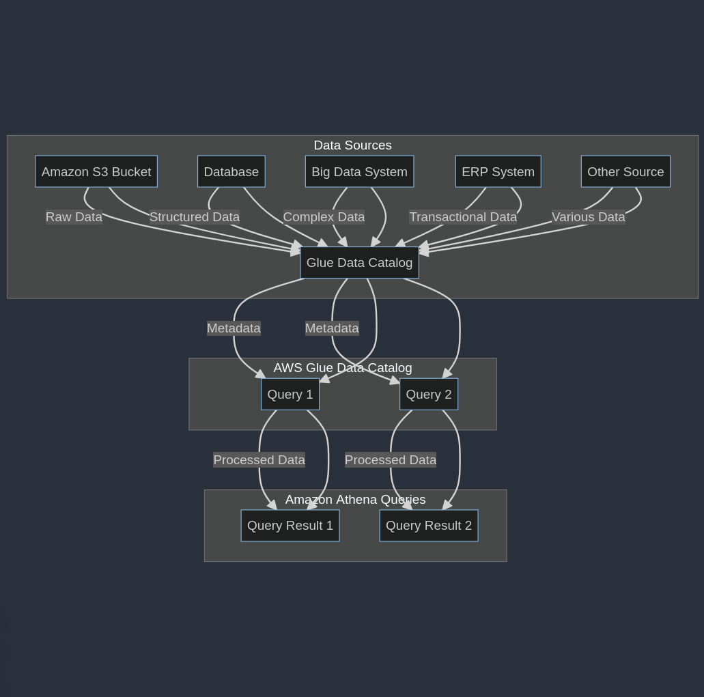

[Amazon Athena](https://aws.amazon.com/athena/){:target="_blank"} is a serverless, interactive analytics service built on open-source frameworks, supporting open-table and file formats. Athena provides a simplified, flexible way to analyze petabytes of data where it lives. Analyze data or build applications from an Amazon Simple Storage Service (S3) data lake and 30 data sources, including on-premises data sources or other cloud systems using SQL or Python. Athena is built on open-source [Trino](https://trino.io/){_target="_blank"} and [Presto](https://prestodb.io/){_target="_blank"} engines and [Apache Spark](https://spark.apache.org/){_target="_blank"} frameworks, with no provisioning or configuration effort required.

Below is a workflow of Amazon Athena:

While working with Amazon Athena, it's essential to review a variety of optimization strategies. [Here's a handy guide](https://aws.amazon.com/blogs/big-data/top-10-performance-tuning-tips-for-amazon-athena/){:target="_blank"} shared by Amazon for top 10 performance tuning tips for Amazon Athena.