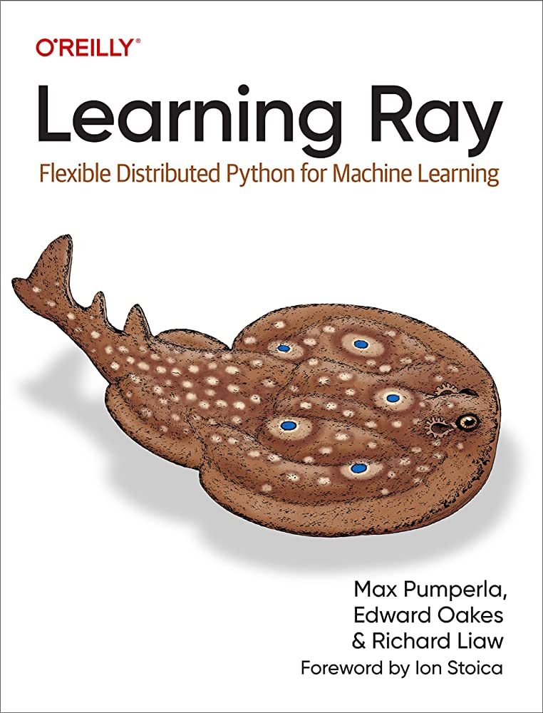

Book Name: [Learning Ray](https://www.anyscale.com/asset/book-learning-ray-oreilly){:target="_blank"}

Published by: O'reilly, 2023

Author: Max Pumperla, Edward Oakes, Richard Liaw

Pages: 250

Rating: 4/5

 
 
I recently came across this awesome book and made available freely by folks at anyscale. It's a very interesting book for Ray and gets you quickly started with it. Definitely recommended for everyone to read.
