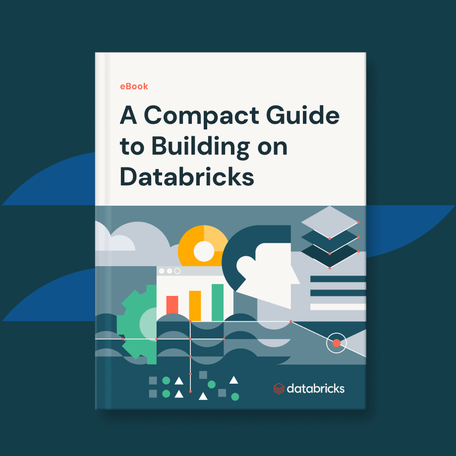

Book Name: [A compact guide to building on Databricks](https://www.databricks.com/resources/ebook/work-faster-data-intelligence-platform){:target="_blank"}

Published by: Databricks, 2024

Author: Databricks Team

Pages: 15

Rating: 5/5

 
 
This short review ebook is a quick fun read about the Databricks platform and if you are getting started with Databricks or want to know about the platform features, this book is very handy. With my experience with Databricks, I found it covering well the important parts including the new AI features around LLMs and generative AI. Hope you enjoy it as much I did :)