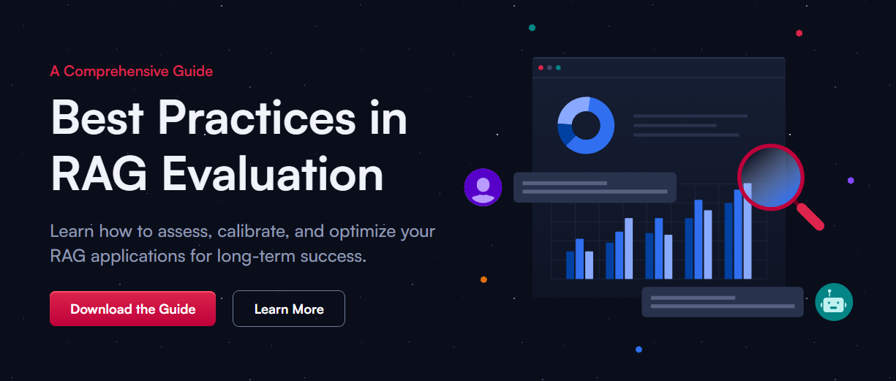

Book Report Name: [A Comprehensive Guide - Best Practices in RAG Evaluation](https://qdrant.tech/rag/rag-evaluation-guide/){:target="_blank"}?

Author Name: [Qdrant](https://qdrant.tech/){:target="_blank"}

Pre-Release Published by: [Qdrant](https://qdrant.tech/){:target="_blank"}

Pages: 24

Rating: 5/5

RAG, LLMs are an essential part of developer, product lifecycle and evaluating them like any software application is of primary importance. This field is yet to mature and get stable with a lot of standard practices and frameworks in pipeline. This books is a very interesting read on the topic and provides some very importance guidance in this field. They have shared context areas and practices currently being followed in consideration of below three frameworks:

1. Quotient AI
2. Ragas
3. Arize Phoenix

Please read it. It's very enjoyable and valuable :)
