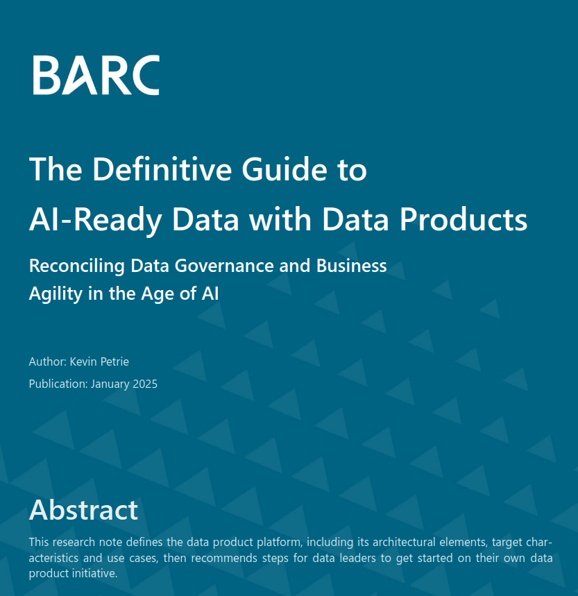

  

**Book Report Name:** [*The Definitive Guide to AI-Ready Data with Data Products*](https://hello.dremio.com/wp-barc-the-definitive-guide-to-ai-ready-data-with-data-products){:target="_blank"}  

**Author Name:** Kevin Petrie  

**Published by:** BARC GmbH (Sponsored by Dremio)  

**Publication Date:** January 2025  

**Pages:** ~16  

**Rating:** 4/5  

---

## **Review**  

I recently read [*The Definitive Guide to AI-Ready Data with Data Products*](https://hello.dremio.com/wp-barc-the-definitive-guide-to-ai-ready-data-with-data-products){:target="_blank"}, and it offers a solid, **practical guide** to structuring data for AI and analytics in modern organizations. While highly informative, I felt that some areas could have been expanded upon—hence my **4-star rating instead of 5**.  

### **What Makes This Guide Valuable?**  

One of the biggest challenges in AI and analytics today is **balancing centralized data governance with decentralized access**. The book introduces **data products**—modular, reusable packages of data and metadata that work like **Lego blocks for analytics and AI**. The idea is to make data **more accessible to business teams** without sacrificing **governance and security**.  

It explains how **Data Product Platforms** help organizations create **self-service data models** while maintaining control over standards, using key architectural components such as:  
- **Table formats** (Apache Iceberg) to ensure flexible, scalable data storage  
- **Query engines** (Dremio, Trino) for high-performance data access  
- **Pipeline tools** (Airflow, dbt) to automate data workflows  
- **Metadata catalogs** (Unity Catalog, Apache Polaris) for structured data governance  

The **real-world case studies** stood out to me. Companies like **Maersk and Henkel** successfully used data product platforms to **reduce costs, improve efficiency, and modernize their analytics infrastructure**. These practical examples help translate theory into real business impact.  

### **Where It Could Be Improved**  

While the book provides an **excellent high-level framework**, it lacks deeper technical implementation details. For example:  
1. **More Detailed Guidance in few areas:** The book covers the *why* and *what* of data product platforms well, but **not the *how***. A more detailed implementation roadmap, including sample workflows and step-by-step architecture planning, would be beneficial.  

### **Practical Takeaways for Businesses**  

For organizations looking to **adopt this approach**, the book recommends a **three-step strategy**:  
1. **Find the pain points**—Identify bottlenecks in BI, analytics, or AI efforts.  
2. **Start small**—Select a high-impact use case and demonstrate quick wins within 3-6 months.  
3. **Expand gradually**—Scale the platform across teams while refining processes.  

### **Final Verdict**  

If you work in **AI, data engineering, or analytics**, this book is a **great resource** for modernizing your data management strategy. It provides a clear roadmap for **building AI-ready, well-governed data environments** while promoting **data democratization**. However, if you're looking for **deep technical implementation details**, you might need to supplement this book with additional resources.  

**Final Rating:** ⭐⭐⭐⭐ (4/5) – *Great for strategic insights, but could use more hands-on depth.* 🚀  
