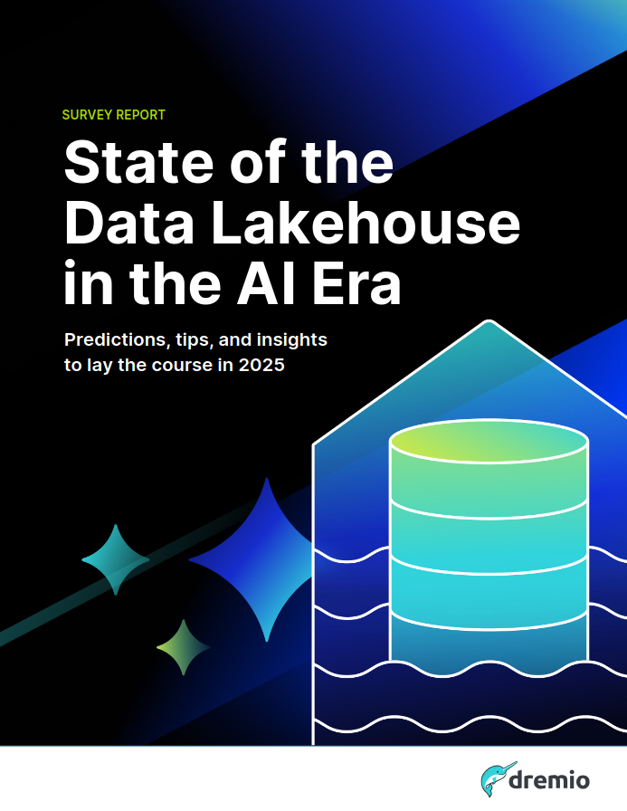

  

**Report Name:** [*State of the Data Lakehouse in the AI Era*](https://hello.dremio.com/wp-2025-state-of-the-data-lakehouse-reg.html)

**Published by:** Dremio  

**Publication Date:** Q4 2024  

**Pages:** ~10  

**Rating:** 4.5/5  

---

## **Review**  

I recently read the [*State of the Data Lakehouse in the AI Era*](https://www.dremio.com), a **comprehensive industry report** analyzing the rapid adoption of **data lakehouses** and their role in the AI-driven enterprise landscape. This report is based on a **survey of 563 IT decision-makers** across multiple industries in the U.S. and provides **key insights into data architecture trends, challenges, and future predictions**.

This is a **must-read** for IT leaders, data engineers, and analytics professionals who want to stay ahead in the evolving AI era. However, while it provides **strong strategic insights**, some deeper implementation details could have made it even more actionable—hence my **4.5-star rating instead of a full 5**.

### **What Makes This Report Valuable?**  

The report highlights the growing dominance of **data lakehouses** as enterprises move away from traditional data warehouses and legacy data lakes. Some of the **most striking findings** include:

- **Mainstream Adoption:** 55% of organizations currently run the majority of their analytics on data lakehouses, projected to **reach 67% within three years**.  
- **AI-Driven Lakehouse Usage:** 85% of organizations are using their lakehouses for **AI model development**, with another **11% planning to do so** soon.  
- **Cost & Efficiency Priorities:** The **top three drivers** for adoption are:
  - **Cost efficiency (19%)**
  - **Unified data access (17%)**
  - **Ease of use (17%)**
- **Migration Trends:** 41% of organizations **migrated from cloud data warehouses**, while 23% **modernized from legacy data lakes**—showing a clear shift in enterprise data strategies.  

One of the most **compelling takeaways** is how **AI-ready data** is now a strategic focus. Organizations are **formalizing their data product strategies (65%)** and **investing in governance, metadata management, and self-service analytics** to support AI-driven innovation.

### **Where It Could Be Improved**  

While the report delivers **great insights**, there are a few areas where it could have gone deeper:  

1. **More Practical Guidance on AI-Ready Data:**  
   The report acknowledges the **challenges of preparing AI-ready data** (like governance, security, and complexity), but it does not provide **step-by-step solutions** for organizations to overcome these hurdles. A detailed **best practices section** or **case study breakdowns** could have added more value.  

2. **More Coverage on Tooling & Implementation:**  
   The report mentions technologies like **Apache Iceberg** and **open metadata solutions**, but it does not dive into the **technical architecture or implementation strategies**. Some organizations may find this high-level view **insufficient for hands-on execution**.  

### **Key Takeaways for Organizations**  

For enterprises looking to **adopt or optimize their data lakehouse strategy**, the report suggests **three major focus areas**:  

1. **Invest in AI-Ready Data Governance:**  
   - **36% of organizations struggle with AI data security and governance**—highlighting the need for **robust compliance frameworks**.  
   - Organizations should **build structured, machine-readable metadata** to ensure AI models operate on **reliable, high-quality datasets**.  

2. **Balance Cost Efficiency with Performance:**  
   - Many organizations (19%) prioritize **cost efficiency**, but **ignoring performance** can lead to **bottlenecks in AI workloads**.  
   - The report suggests using **autonomous scaling and query optimization** to ensure **AI and analytics workloads run efficiently**.  

3. **Enable Self-Service Analytics—But Solve Governance First:**  
   - While **80% of enterprises aim for self-service analytics**, **42% cite security concerns as a major barrier**.  
   - The key to success is **combining governance with accessibility**, using **structured workflows and automation**.  

### **Final Verdict**  

If you're a **data leader, AI strategist, or enterprise architect**, this report is a **must-read**. It provides a **crystal-clear overview of the industry shift toward AI-powered data lakehouses** and offers **data-driven insights into adoption trends, challenges, and best practices**.

However, if you're looking for **in-depth technical implementation details**, you may need to supplement this with **additional resources** on data lakehouse architectures, governance frameworks, and tooling.

**Final Rating:** ⭐⭐⭐⭐⭐ (4.5/5) – *Highly insightful, but could benefit from more hands-on depth.* 🚀  
