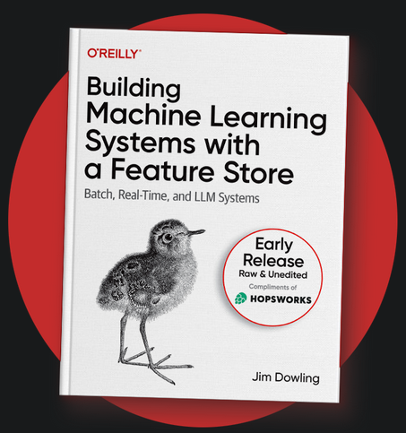

Book Report Name: [Building Machine Learning Systems with a feature store](https://www.hopsworks.ai/lp/oreilly-book-building-ml-systems-with-a-feature-store){:target="_blank"}?

Author Name: Jim Downling

Pre-Release Published by: O'reilly Media, Inc.

Pages: 137

Rating: 5/5

This pre-release yet to be published free book on Building machine learning systems using a feature store is an awesome read. At it's current stage, it has four chapters but you get the latest chapter which is updated in your inbox. To be fair, I had a very interesting time reading this book and always look forward to the next chapter in series from the authors. If you are into machine learning systems, this book is a definite read for you. It gets you started with machine learning, the need for a feature store and ultimately building and using such a system. Hope you enjoy it reading as much as I did :)
